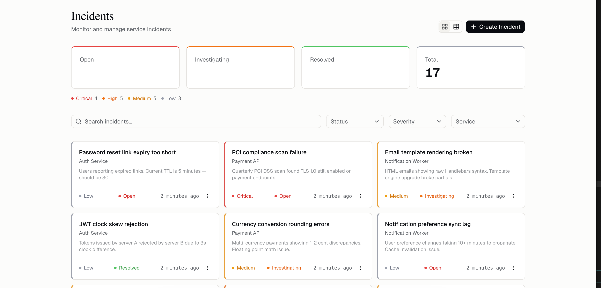
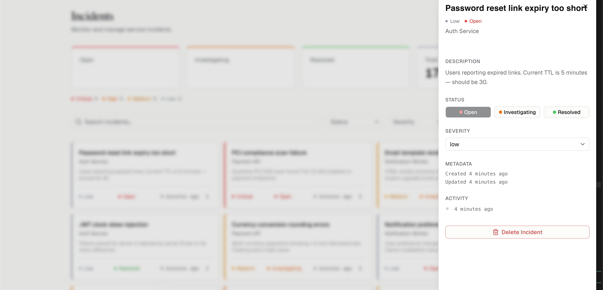

# Real-Time Incident Management Panel

<div align="center">

<br/>

[](http://158.220.112.110)

<h3><a href="http://158.220.112.110">http://158.220.112.110</a></h3>

<br/>

</div>

A centralized incident management dashboard for monitoring and managing service incidents across Payment API, Auth Service, and Notification Worker. Features real-time updates via WebSocket, async event processing with BullMQ, and a clean editorial React dashboard.

| Dashboard | Incident Detail |
|-----------|----------------|
|  |  |

## Tech Stack

| Layer | Technology |
|-------|-----------|
| Backend | NestJS 11, TypeORM 0.3, PostgreSQL 16, BullMQ, Socket.IO |
| Frontend | React 19, Vite 6, TypeScript 5, TanStack Query v5, Zustand 5, shadcn/ui, Tailwind CSS 4, Framer Motion |
| Infrastructure | Docker, docker-compose, nginx, Redis 7 |

## System Architecture

```
┌─────────────┐     REST API      ┌──────────────────────┐
│   Frontend   │◄────────────────►│     NestJS Backend    │
│  (React 19)  │                  │                       │
│              │   Socket.IO      │  Controller → Service │
│              │◄─────────────────│       ↓               │
└─────────────┘                   │  Repository (TypeORM) │
                                  │       ↓               │
                                  │  BullMQ Producer      │
                                  └───────┬───────────────┘
                                          │
                                          ▼
                                  ┌───────────────┐
                                  │     Redis      │
                                  │ • BullMQ Queue │
                                  │ • Socket.IO    │
                                  │   Adapter      │
                                  └───────┬───────┘
                                          │
                                          ▼
                                  ┌───────────────────────┐
                                  │  Event Consumer        │
                                  │  (BullMQ Worker)       │
                                  │  • Create timeline     │
                                  │  • Socket.IO broadcast │
                                  │  • Queue ingestion     │
                                  └────────────────────────┘
                                        │         ▲
                                        ▼         │
                                  ┌───────────┐   │
                                  │PostgreSQL  │   │  incident.ingest
                                  │• incidents │   │  (external services
                                  │• timelines │   │   push directly)
                                  └───────────┘   │
                                                  │
                                  ┌───────────────────────┐
                                  │  External Services     │
                                  │  Payment API           │
                                  │  Auth Service          │
                                  │  Notification Worker   │
                                  └────────────────────────┘
```

### Request Flow

```
HTTP Channel (UI / API Clients)
═══════════════════════════════════════════════════════════════

  Client ──POST /incidents──▶ Controller ──validate──▶ Service
                                                         │
                                                    save to DB
                                                         │
                                                    queue.add('incident.created')
                                                         │
                                                         ▼
                                                  ┌──── Redis Queue ◄──── External Service
                                                  │     (BullMQ)          queue.add('incident.ingest')
                                                  │
                                                  ▼
Queue Channel (External Services)           Event Consumer
═══════════════════════════════════    ┌──────────────────────┐
                                      │ 1. Write timeline    │
  Payment API ───┐                    │ 2. Socket broadcast  │
  Auth Service ──┤── queue.add() ──▶  │ 3. (ingest: save DB) │
  Notif Worker ──┘                    └──────────┬───────────┘
                                                 │
                                                 ▼
                                        Socket.IO Rooms
                                      ┌─────────────────┐
                                      │ incidents:all    │──▶ All dashboard clients
                                      │ incident:{id}   │──▶ Detail sheet viewers
                                      └─────────────────┘

Real-time Update Flow
═══════════════════════════════════════════════════════════════

  DB Write ──▶ Queue Event ──▶ Consumer ──▶ Socket.IO ──▶ Frontend
                                               │
                                          invalidateQueries()
                                               │
                                          TanStack Query refetch
                                               │
                                          React re-render (animated)
```

### Optimistic Locking Flow

```
  User A: GET /incidents/1         (version: 3)
  User B: GET /incidents/1         (version: 3)

  User A: PATCH {status, version: 3}  ──▶ UPDATE ... WHERE version=3 ──▶ ✅ (version → 4)
  User B: PATCH {status, version: 3}  ──▶ UPDATE ... WHERE version=3 ──▶ ❌ 409 Conflict

  Frontend: toast("Modified by another user") → invalidateQueries() → fresh data
```

### Graceful Degradation (Redis Down)

```
  Normal:    Service ──▶ Queue ──▶ Consumer ──▶ Timeline + Socket
  Fallback:  Service ──▶ Queue ✗ ──▶ Sync: Timeline write + Socket emit directly
  Result:    CRUD always works. Real-time degrades to single-instance.
```

## Prerequisites

- Docker + Docker Compose

## Quick Start

```bash
# Clone the repository
git clone git@github.com:Menesahin/incident.git
cd incident

# Configure environment
cp .env.example .env
# Edit .env with your values (POSTGRES_PASSWORD, CORS_ORIGIN)

# Start all services
docker compose up -d

# Load seed data (optional)
docker compose --profile seed up seed
```

The dashboard will be available at `http://localhost` (or your configured domain).

## Development Setup

```bash
# Start infrastructure
docker compose up postgres redis -d

# Backend
cd backend
cp ../.env.example ../.env
pnpm install
pnpm start:dev
# → http://localhost:3000/api/v1
# → http://localhost:3000/api/docs (Swagger)

# Frontend (separate terminal)
cd frontend
pnpm install
pnpm dev
# → http://localhost:5173
```

## API Endpoints

| Method | Endpoint | Description |
|--------|----------|-------------|
| `POST` | `/api/v1/incidents` | Create a new incident |
| `GET` | `/api/v1/incidents` | List incidents (paginated, filterable) |
| `GET` | `/api/v1/incidents/stats` | Dashboard statistics |
| `GET` | `/api/v1/incidents/:id` | Get incident details + timeline |
| `PATCH` | `/api/v1/incidents/:id` | Update incident (with optimistic locking) |
| `DELETE` | `/api/v1/incidents/:id` | Soft delete incident |

### Query Parameters

| Param | Type | Description |
|-------|------|-------------|
| `page` | number | Page number (default: 1) |
| `limit` | number | Items per page (default: 10, max: 100) |
| `status` | enum | `OPEN`, `INVESTIGATING`, `RESOLVED` |
| `severity` | enum | `LOW`, `MEDIUM`, `HIGH`, `CRITICAL` |
| `service` | enum | `PAYMENT_API`, `AUTH_SERVICE`, `NOTIFICATION_WORKER` |
| `search` | string | Search in title and description (ILIKE) |
| `sortBy` | string | Sort field (default: `createdAt`) |
| `sortOrder` | string | `ASC` or `DESC` (default: `DESC`) |

## Environment Variables

| Variable | Description | Default |
|----------|-------------|---------|
| `POSTGRES_USER` | Database user | `incident` |
| `POSTGRES_PASSWORD` | Database password | `incident123` |
| `POSTGRES_DB` | Database name | `incident_db` |
| `NODE_ENV` | Environment (`development` / `production`) | `production` |
| `CORS_ORIGIN` | Allowed CORS origin | `http://localhost` |
| `BACKEND_PORT` | Backend exposed port | `3000` |
| `FRONTEND_PORT` | Frontend exposed port | `80` |

> **Note:** Swagger documentation is only available in development mode (`NODE_ENV=development`).

## Queue-Based Ingestion (External Services)

External services can push incidents directly to the BullMQ queue without going through HTTP. The consumer creates the incident in the database, writes a timeline entry, and broadcasts via Socket.IO — the same pipeline as HTTP-created incidents.

**Two ingestion channels:**

| Channel | Flow | Use Case |
|---------|------|----------|
| **HTTP** | `POST /api/v1/incidents` → Service → DB → Queue → Consumer (timeline + socket) | Dashboard UI, API clients |
| **Queue** | `queue.add('incident.ingest', payload)` → Consumer → DB + timeline + socket | External services, microservices |

**Queue job format:**

```typescript
import { Queue } from 'bullmq';

const queue = new Queue('incident-events', {
  connection: { host: 'redis', port: 6379 },
});

await queue.add('incident.ingest', {
  title: 'Database timeout on payment service',
  description: 'Users receiving timeout errors during checkout',
  service: 'PAYMENT_API',       // PAYMENT_API | AUTH_SERVICE | NOTIFICATION_WORKER
  severity: 'CRITICAL',         // CRITICAL | HIGH | MEDIUM | LOW
});
```

## Architecture Decisions

| Decision | Rationale |
|----------|-----------|
| **BullMQ over Kafka** | Lightweight infrastructure. Redis already required for Socket.IO adapter. Kafka justified at 10K+ events/day with multi-consumer needs. |
| **Socket.IO + Redis Adapter** | Bidirectional communication, built-in reconnect/fallback, room-based event routing, multi-instance support. |
| **Optimistic Locking** | `@VersionColumn` provides lock-free throughput, DB-level atomicity, no deadlock risk. Conflicts handled with HTTP 409 + client refetch. |
| **Async Event Pipeline** | Service produces events to BullMQ queue. Consumer handles side-effects (timeline, socket broadcast). Decoupled, retryable, extensible. |
| **Dual Ingestion** | HTTP for UI/API clients, queue for external microservices. Both channels converge at the same consumer for consistent processing. |
| **UPPER_CASE Enums** | All enum values use consistent UPPER_CASE convention (OPEN, CRITICAL, PAYMENT_API). Display labels mapped separately. |
| **Graceful Degradation** | CRUD always works even if Redis is down. Queue operations fall back to synchronous processing. |
| **Repository Pattern** | QueryBuilder complexity isolated from service layer. SORT_WHITELIST prevents SQL injection on sort fields. |
| **Soft Delete** | `@DeleteDateColumn` preserves audit trail. Incidents are never physically removed. |
| **Full Object Payload** | Socket events carry complete incident data. Zero-latency client cache updates without additional HTTP roundtrips. |

## Assumptions

- No authentication/authorization (not in requirements, case study scope optimization)
- Free status transitions between any states (no strict state machine)
- Single Redis instance with graceful fallback (production would use Sentinel/Cluster)
- PostgreSQL `synchronize: true` in development only; migrations required for production schema changes

## Future Improvements

- **Kafka** for high-volume event streaming with consumer groups
- **Authentication + RBAC** with JWT and role-based guards
- **Notification system** (email, Slack, PagerDuty webhooks for critical incidents)
- **Monitoring** with Prometheus metrics + Grafana dashboards
- **Rate limiting** with `@nestjs/throttler` + Redis store
- **E2E tests** with testcontainers
- **AI classification** (auto-suggest severity/service from title + description)
- **Redis Sentinel/Cluster** for production high availability
- **Strict state machine** for incident status transitions
- **Monorepo** with Turborepo for shared types between frontend and backend
